# First Time Sprinters Workshop
aka. Drupal Community Tools

Note: These slides go with the Community Tools curriculum which can be found at http://drupalize.me/community-tools

-------
## Why Are We Here?

“It’s really the Drupal community and not so much the software that makes the Drupal project what it is. So fostering the Drupal community is actually more important than just managing the code base.”
- Dries Buytaert

-------
## Our Tools

- **Communication tools**
    - Community websites
    - Issue queues
    - IRC
- **Local development environment**
   - Web Stack
   - Git

Note: What OS are people on? What “category” : site builder, dev, themer, designer

====================================
## Community Websites

------
## drupal.org (d.o)

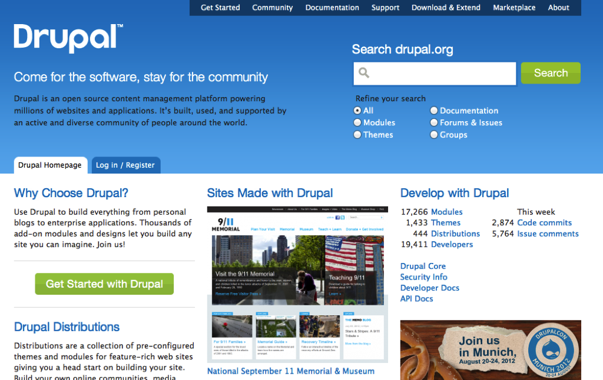

Note: This is where the work of the Drupal Community lives. Code, handbooks, support forums, and issue queues — all contributed by the community — live here on drupal.org.

------
## groups.drupal.org (g.d.o)

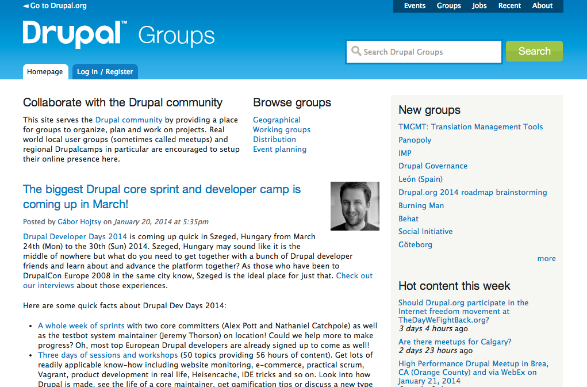

Note: This is where you can look for events, regional and working groups, and jobs in the Drupal community. You can use a keyword search or the tabs at the top of the page which provide specific filters.

------
## Searching groups.drupal.org 

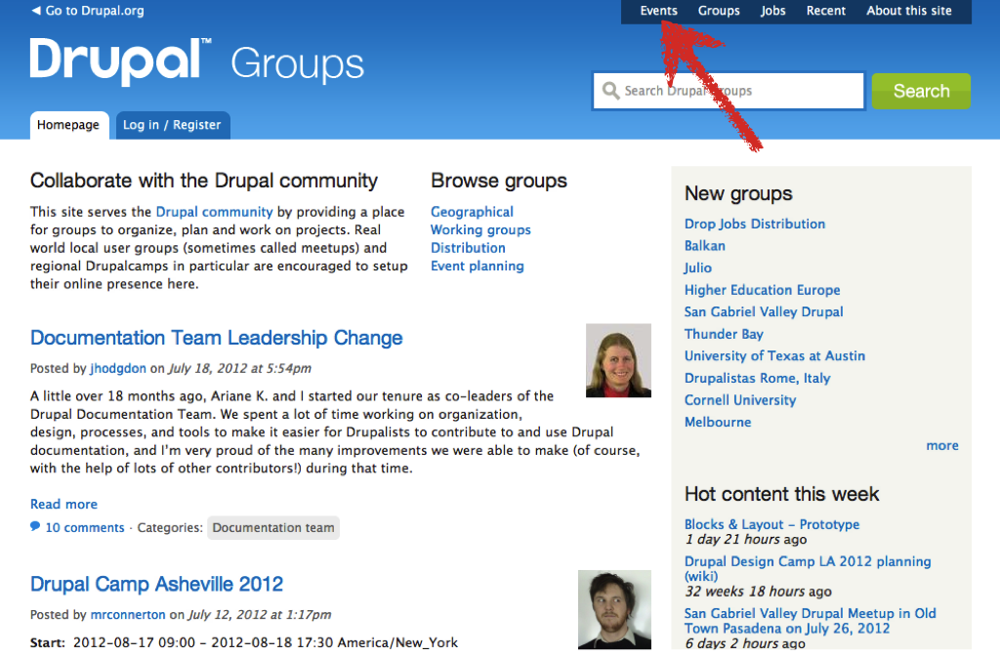

Search for events

Note: using the events tab makes it easier to find events instead of just a keyword search

------
## Searching groups.drupal.org 

Search for groups 

Note: using the groups tab makes it easier to refine groups instead of just keyword search

------
## Working and regional Groups and Meetups

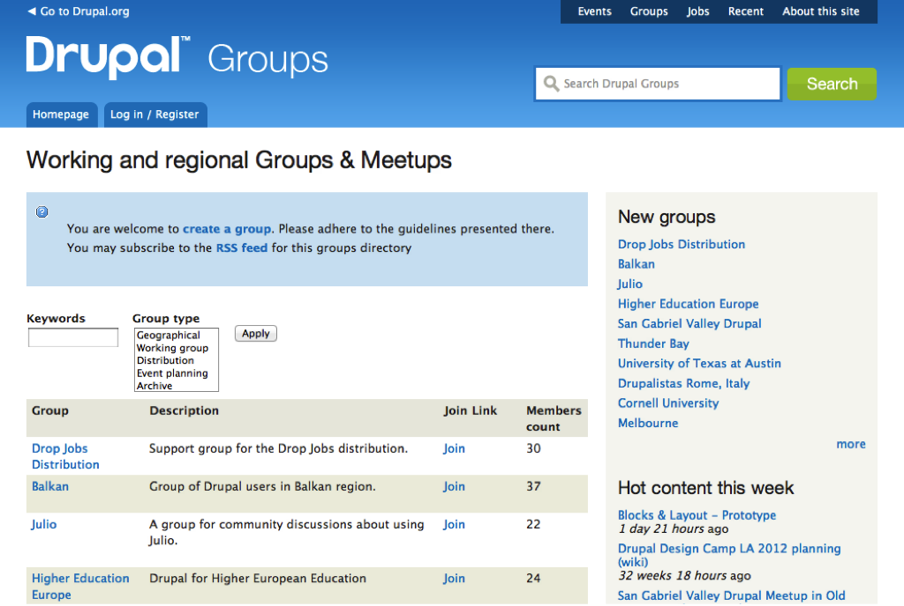

Note: A good place to start on g.d.o is to search for a group in your geographical area. Other types of groups are those formed around the intersection of Drupal and another area of common ground, for example, Drupal in Higher Education. Working groups also exist where discussion and information about technical projects are organized.

------
## api.drupal.org (api.d.o)

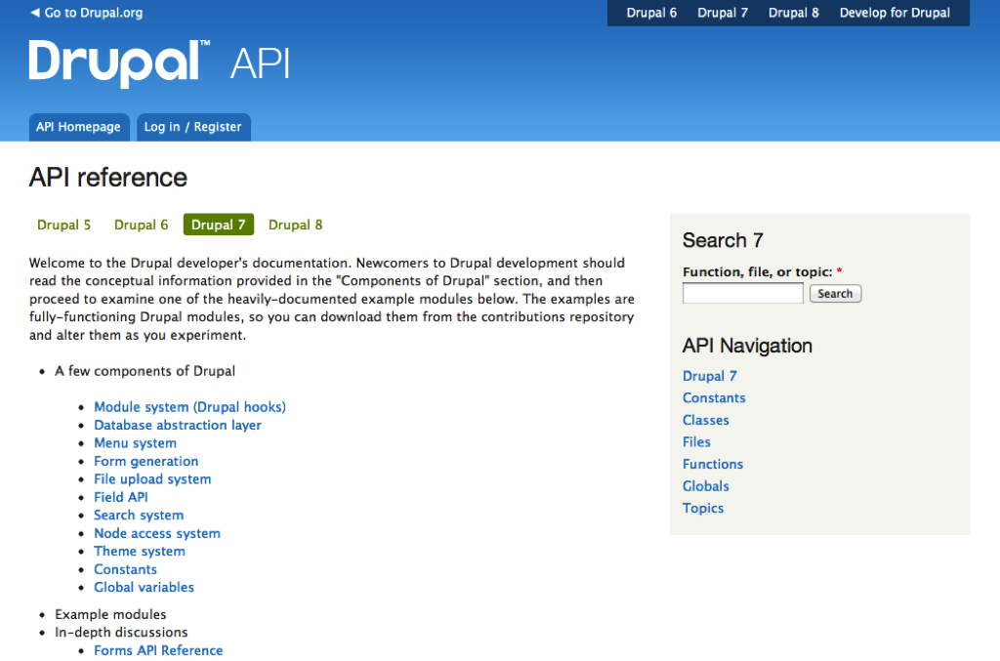

Note: This is where the code documentation in Drupal lives. This is where you would find the specifics about how to implement the Drupal API in your code or better understand how the code works in Drupal.

------
## association.drupal.org 

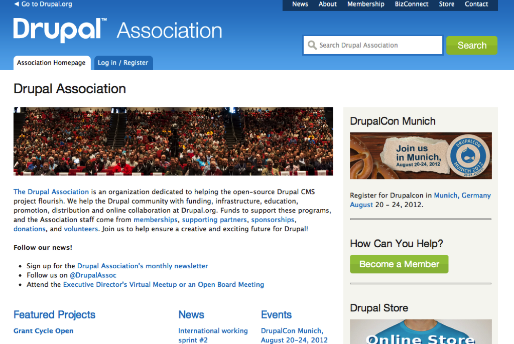

Note: The Drupal Association exists to support the Drupal community. It doesn't steer the technical direction of Drupal, but provides the support and infrastructure to run drupal.org, g.d.o, association.drupal.org, api.drupal.org, and the DrupalCon websites. It also provides a necessary fiscal entity that is used by the community and organizes DrupalCon.

------
## drupalladder.org 

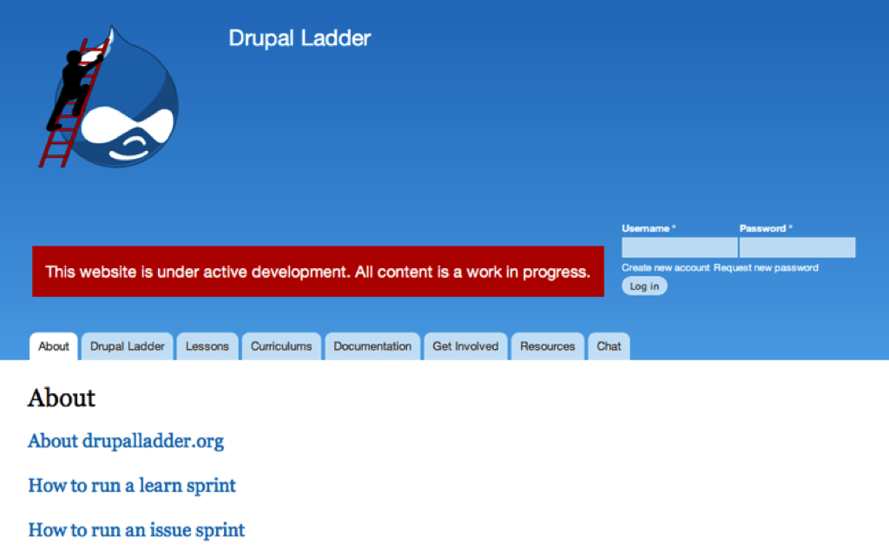

Note: This is not a Drupal Association supported website but was brought about by members of the Drupal community who are passionate about educating people on how to contribute to Drupal.

------
## drupical.com

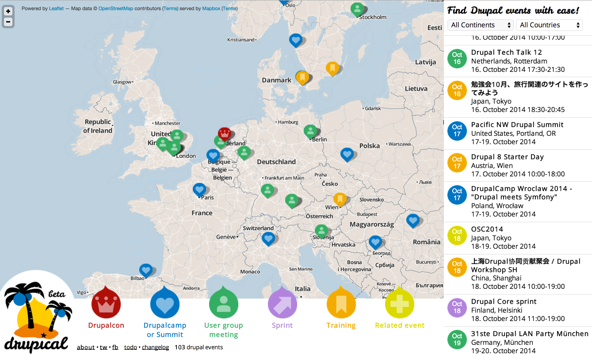

Note: Not a Drupal Association support site, but serves a nice/different visualization on top of the g.d.o. events feed.

------
## Drupal.org Account

Also gets you in to:

- groups.drupal.org
- api.drupal.org
- association.drupal.org
- DrupalCon sites

------
## Activity: Create a d.o account

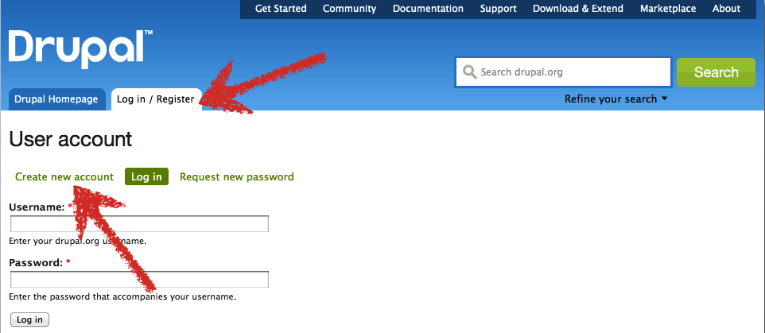

------
## Bonus Round: Groups

Find & join the demo group created for these sprints.

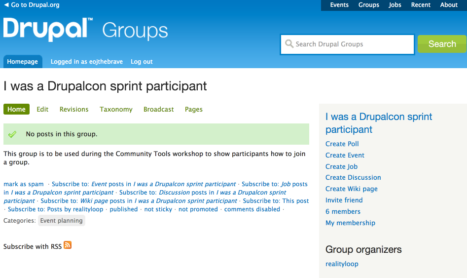

Notes: Lots of possible solutions. One way search for "drupalcon sprint", filter to just groups, find it in the list, and join.

====================================
## The Issue Queue

The community todo list

Note: This is all a brief tour of the core issue queue and hands-on creating an issue using the Drupal Ladder lesson

-----
## Dreditor

- Makes the issue queue easier to work with
- Is a browser user script (not a module)
- https://dreditor.org/

======================================
## Getting All the Files

- Installing BTSync
- https://drupal.org/dctdi

======================================
## IRC (Internet Relay Chat)

Real time communication with other Drupal developers around the world.

-----
## What You Need to Use IRC

- IRC client
- IRC Network to connect to
- Channels to join
- Nickname

-----
## IRC Clients

- Web-based clients
    - webchat.freenode.net
- Application clients (you don't need to download these now)
    - LimeChat (Mac) - http://limechat.net/mac/
    - XChat (Linux)  - http://xchat.org/
    - XChat (Win)    - http://www.silverex.org/download/
    - ChatZilla (Firefox extension)

-----
## Network

- Over 650 networks
- Most Open Source projects use the Freenode network
- Address: irc.freenode.net

-----
## Channels

- Freenode has over 10,000 public channels
- The Drupal community has over 100 channels (listed at: drupal.org/irc)
- Drupal channel names all start with #

-----
## Install an IRC Client

You'll have an opportunity to install an IRC client during the community tools install process

-----
## Choose a Nickname

- No authentication required to log in.
- Someone might already have the name you want
- Register your nick to preserve it.

Note: Digital identity in IRC isn’t like web sites. You can log in to a system with someone else’s user name. Eventually you will get kicked off if you don’t enter the password for that user name. This is unlike a web site where you can’t log in without a password.

-----
## Join a Channel

Let's start chatting!

- Network: irc.freenode.net
- Channel: #drupal-ladder

Note: Give everyone a few minutes to get logged in and type a "hello" message into the channel.

------
## Notifications

- Ping!
- Use names in conversation to help track.
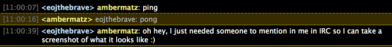
- Keep conversation in public channels.
- Private Messages (PM) should start with a request in a public channel.

Note: There will be lots of conversations happening at the same time in a channel. Using a person’s name helps to track the conversation. Starting a conversation. Private conversations.

=======================================
## Local Dev Environment

Not just for programmers

-----
## What?

- A Development Environment is a collection of procedures and tools for developing, testing and debugging an application or program.
- LOCAL means you have can do this on your personal computer, not a remote web server.

-----
## Why?

- Working on a live site is dangerous and stupid.
- You can use the tools you like best.
- You don’t mess up other people working.
- You can work with insecure sites/code.
- You can work offline.
- Geek coolness factor.

-----
## How?

You need a web stack with the following components:

- Apache web server
- PHP application server
- MySQL database server

 A way to move your work

- (S)FTP
- Version control

-----
## Web Stacks

- Mac OS X: Acquia Dev Desktop
- Windows: Acquia Dev Desktop
- Ubuntu: Bitnami Drupal Stack

=========================================
## Version Control and Git

-----
## What?

- A way to keep track of changes
- Many different systems for this:
    - Centralized (CVS, SVN)
    - Distributed (Git, Bazaar, Mercurial)

-----
## Why?

- Backup, backup, backup
- Merging multiple people’s work
- Easily see changes/history
- Easily move/update code in many places

-----
## Why Git?

The Drupal.org community uses it 
http://groups.drupal.org/node/48818

=========================================
## What We're Doing

- Optionally install an IRC Client
- Install a full web stack
- Install and configure Git
- Clone Drupal 8 with Git
- Install a Drupal 8 site

-----
## Groups

- Do you have AMP, Git, and Drupal 8 installed?
- Do you have AMP and Git installed?
- Do you have AMP installed?

------
## Demonstration

- Running through installation

------
## Install fest
Install AMP Stack Git and Drupal 8

- https://drupal.org/dctdi

